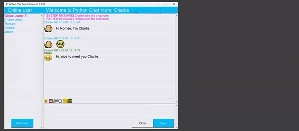

# Python chatroom
Final project, Introduction to Computer Science, Fall 2021, NYU Shanghai

## Requirements

This Python version for this project is Python 3.9. Other versions of Python are not guaranteed to be compatible with this project. The packages required are as listed in `requirements.txt`. It is recommended that one creates a virtual environment and install the packages as specified.

By the way, this project is done in my first semester of learning Python, so there may be many potential errors in it. Use at your own risk!

## Functionalities

The functionalities of this Python chatroom can be seen in the final presentation `presentation.pptx`. Some of the mechanisms of this project are also explained in there.

Still, as a brief introduction, this is a chat system implemented using Python, with basic functionalities such as group chat and private chat, chat history, etc. The chat system acts as a communication substrate, on top of which we implement additional functionality:

- A graphic user interface for the chat system, referring to that of WeChat.
Sending images, emojis, videos, and files apart from pure text messages.
- A graphic user interface for viewing, searching, and deleting chat history.
- Creating account and signing in, using a simple database.
- Two classical games integrated into the chat system, referring to WeChat mini programs.

